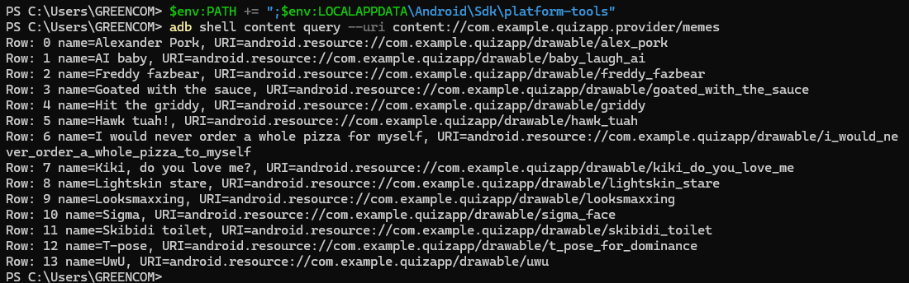

# Meme Quiz App
An Android application featuring a custom meme gallery and an interactive quiz.

## Features
- **Brainrot Gallery:** View, sort, and add new memes with custom labels.
- **Brainrot Quiz:** Test meme knowledge with dynamic questions.
- **Persistence:** Custom images and labels persist across screens.

## Technical Details
- **Language:** Kotlin
- **UI:** Jetpack Compose / Material 3
- **Image Loading:** Coil

## Test Documentation

### Test 1 — Navigation: Main Menu → Quiz
**Class/Method:** `MainActivityTest.clickQuizActivityButton()`

**Description:** The user is on the main menu screen. They tap the "Start Quiz" button. The app should navigate to the Quiz activity.

**Expected Result:** An Intent targeting `Quiz` activity is fired.

**Status:** ✅ Pass

---

### Test 2 — Quiz: Correct Answer Increments Score
**Class/Method:** `QuizActivityTest.correctAnswerAndIncrementsScore()`

**Description:** The Quiz activity is launched directly. The test reads the correct answer from the ViewModel and clicks the matching button. Both `correctAnswers` and `attempts` should become 1.

**Expected Result:** `correctAnswers == 1`, `attempts == 1`

**Status:** ✅ Pass

---

### Test 3 — Quiz: Wrong Answer Does Not Increment Score
**Class/Method:** `QuizActivityTest.incorrectAnswerAndIncrementsScore()`

**Description:** The Quiz activity is launched directly. The test clicks an answer that is not the correct one. `attempts` should become 1 but `correctAnswers` should stay 0.

**Expected Result:** `correctAnswers == 0`, `attempts == 1`

**Status:** ✅ Pass

---

### Test 4 — Gallery: Deleting a Meme Decreases Count
**Class/Method:** `GalleryActivityTest.deletingMeme_decreasesCount()`

**Description:** The Gallery activity is launched directly. The test records the meme count, clicks the delete button on the first meme card, then checks the count decreased by 1.

**Expected Result:** `countAfter == countBefore - 1`

**Status:** ✅ Pass

---

### Test 5 — Gallery: Adding a Meme Increases Count
**Class/Method:** `GalleryActivityTest.addingMeme_incrementCount()`

**Description:** The Gallery activity is launched directly. Intent stubbing intercepts the photo picker and returns a fake image URI (`alex_pork` drawable) without user interaction. The test records the count before, clicks the Add button, then checks the count increased by 1.

**Expected Result:** `countAfter == countBefore + 1`

**Status:** ✅ Pass

---

## ContentProvider Testing with adb
```bash
adb shell content query --uri content://com.example.quizapp.provider/memes
```

